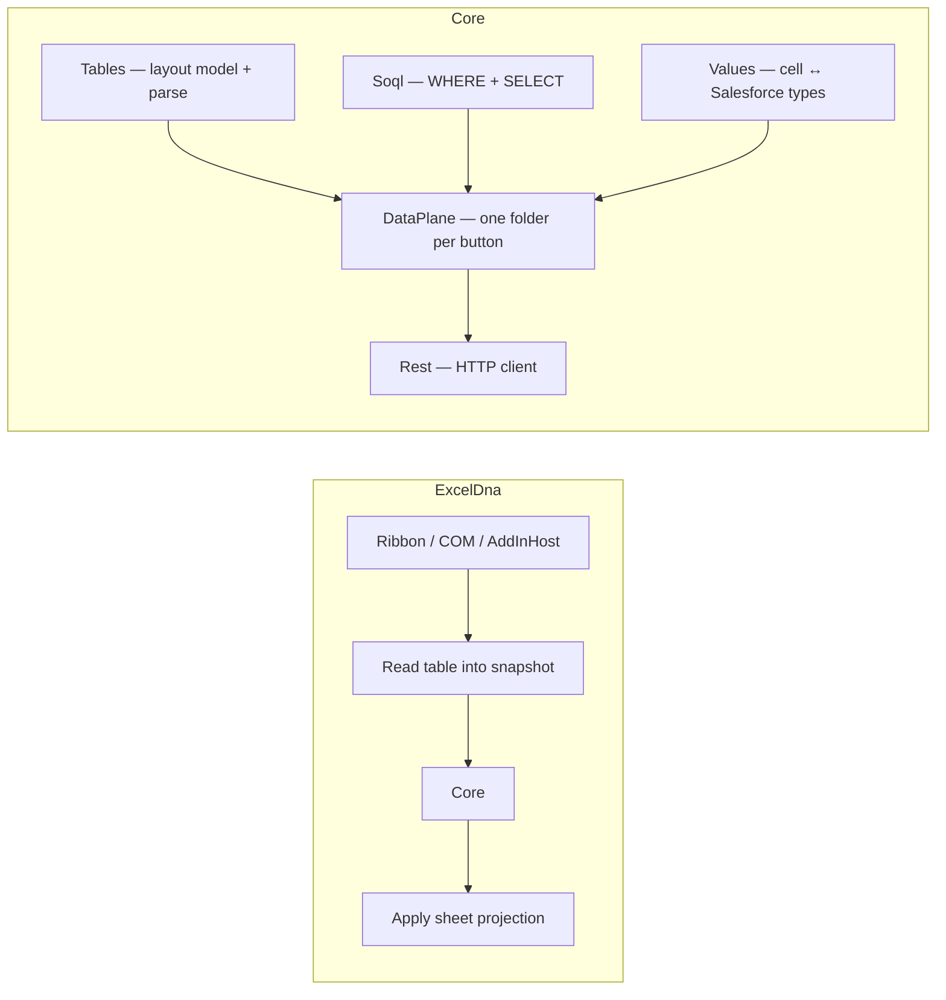

# Data plane design

How to **group** ribbon and COM data operations so related code stays together, while keeping Salesforce logic testable without Excel.

**Related:** [common-performance-requirements.md](./common-performance-requirements.md) · [test-cases.md](./test-cases.md)

---

## Principles

| Principle | Meaning here |
|-----------|----------------|
| **Cohesion** | Table parsing, SOQL, and “query table” live near each other; don’t scatter one feature across unrelated folders |
| **Core vs Excel** | If it touches `Range` or `Application`, it’s ExcelDna; if it’s SOQL, field types, or REST payloads, it’s Core |
| **One path, two entry points** | Ribbon and COM call the same Core operation; only the host wrapper differs |
| **Bulk in/out** | Core works on `object[,]`; Excel reads/writes ranges in few COM calls |
| **Test what matters** | Unit-test parsers and planners with arrays; HTTP tests use `SequentialMockHttpHandler` |

No extra abstraction layers for their own sake — add a type or interface when two call sites need it or tests need a seam.

---

## What lives where



**ExcelDna** does: login gate, resolve the table under the selection (header left-scan / blank-column bounds), show confirm/progress, call Core, write results back within that column span.

**Core** does: validate table, build SOQL or composite payloads, call REST, turn responses into a `SheetProjection`.

---

## Folder layout

Group by **topic**, not by abstract layer:

```
SalesforceRestAddin.Core/
├── Tables/              # ForceTable snapshot, parse row 1/2/3+, bind to describe
├── Soql/                # Criteria parsing, WHERE building, escaping
├── Values/              # FieldValueConverter, reference name↔id
├── DataPlane/
│   ├── QueryTable.cs    # Query table data (+ shared result types)
│   ├── QueryRows.cs     # Query selected rows + refresh
│   ├── UpdateCells.cs
│   ├── InsertRows.cs
│   ├── DeleteRecords.cs
│   └── DescribeObject.cs
└── Rest/                # SalesforceDataClient (query, composite, describe)
```

ExcelDna:

```
SalesforceRestAddin.ExcelDna/
├── Tables/
│   ├── ForceTableReader.cs      # Table bounds (blank-column separated) → ForceTableSnapshot
│   └── SheetProjectionWriter.cs # SheetProjection → Range (formats + AutoFit)
└── AddInHost.cs                 # Wires gate + reader + Core op + writer
```

Each file under `DataPlane/` should hold **one ribbon/COM operation end-to-end** in Core (parse/bind/plan/execute/project as private steps or local functions), pulling shared helpers from `Tables/`, `Soql/`, `Values/` rather than duplicating.

---

## Shared types (used across operations)

### `ForceTableSnapshot`

What Excel hands Core after one bulk read. Plain data — no Excel types.

| Member | Source |
|--------|--------|
| `ObjectApiName` | A1 comment or value |
| `CriteriaRow` | Row 1 from col B (labels, operators, values) |
| `HeaderLabels` | Row 2 |
| `HeaderApiNames` | From row-2 comments (`API Name: X`) or label map |
| `Body` | Row 3+ `object[,]` |
| `IdColumnIndex` | 0-based |
| `HiddenRowIndices` / `HiddenColumnIndices` | Optional; used when `IncludeHiddenCells` is false (default) |

### `SObjectDescribe` / `FieldDescriptor`

Mapped from REST describe: name, label, type, createable, updateable, reference targets, picklists. `FieldCatalog` indexes by API name and label.

### `ForceTableBinding`

Snapshot + describe + `ConnectorOptions` → which columns map to which fields. Validation errors include 1-based row/col for user messages.

### `SheetProjection`

What Core hands Excel after an operation:

```csharp
public sealed class SheetProjection
{
    public required object[,] Values { get; init; }
    public int StartRow { get; init; }
    public int StartColumn { get; init; }
    public IReadOnlyList<ColumnFormat>? ColumnFormats { get; init; }
    public IReadOnlyList<RowOutcome>? RowOutcomes { get; init; }  // failures only
}
```

`SheetProjectionWriter` assigns `Values` in one shot, applies column formats, then styles only failed rows.

---

## Typical flow (all data buttons)

Same shape everywhere; each `DataPlane/*.cs` file implements it for its button:

```
1. Read    Excel → ForceTableSnapshot (+ selection slice if needed)
2. Bind    Describe + ForceTableParser → binding or validation error
3. Plan    SOQL string, or list of composite record batches
4. Run     SalesforceDataClient (HTTP); cancel between batches
5. Write   Core → SheetProjection → Excel bulk write
```

Shared steps live in `Tables/`, `Soql/`, `Values/`. The operation file sequences them.

---

## Per-button Core responsibilities

### `QueryTable.cs`

- Parse row-1 triplets (`Soql/`) → WHERE
- Build `SELECT … FROM … WHERE …`
- `Id`/reference `in`/`on`: batched `IN` clauses (not one SOQL per Id)
- Paginate `GET /query`; optional COUNT before large downloads
- Project rows to `object[,]`; `#N/F` / `#Err` when needed

### `QueryRows.cs`

- Ids from selected rows; chunk for composite retrieve
- Project into body columns; leave Id column unchanged
- **Refresh** variant: expand to contiguous Id rows before read (same file, flag on input)

### `UpdateCells.cs`

- Build PATCH records from selection slice (updateable fields only)
- `IncludeHiddenCells` false (default): drop hidden indices in memory after bulk read; true: send all selected cells
- Map save results → `RowOutcome` list

### `InsertRows.cs`

- Rows with Id matching `(?i)^new`
- POST create; write back new Ids

### `DeleteRecords.cs`

- Ids from Id column (not hardcoded column A)
- DELETE composite; `"deleted"` or errors per row

### `DescribeObject.cs`

- REST describe → metadata grid `object[,]` on new sheet (field ordering: standard → custom)

### Table Query Wizard

WPF wizard in `SalesforceRestAddin.Windows.Ui`. Core helpers only:

- Field ordering for row 2 (Id → Name → Required (std/custom) → Standard → Custom → Read-only (std/custom))
- Default WHERE when no clauses
- Shared grid sort state for the object picker and field picker: promote clicked column to the front, sort ascending the first time, toggle only the current first column on repeat click
- Calls `QueryTable` at the end — no second implementation

---

## REST client

Extend the existing `Rest/` area with a focused client used by all `DataPlane/*` files:

```csharp
// Rest/SalesforceDataClient.cs — concrete class; interface only if tests need it
public sealed class SalesforceDataClient
{
    public Task<SObjectDescribe> DescribeAsync(string objectApiName, CancellationToken ct);
    public Task<QueryResultPage> QueryAsync(string soql, string? nextUrl, CancellationToken ct);
    public Task<IReadOnlyList<Dictionary<string, object?>>> RetrieveAsync(...);
    public Task<IReadOnlyList<SaveResult>> CreateAsync(...);
    public Task<IReadOnlyList<SaveResult>> UpdateAsync(...);
    public Task<IReadOnlyList<DeleteResult>> DeleteAsync(...);
}
```

Uses `SalesforceAuthenticatedClient` underneath. Tests either mock this class or enqueue responses on `SequentialMockHttpHandler`.

---

## Shared helpers (small, reused)

| Helper | Where | Used by |
|--------|-------|---------|
| `ForceTableParser` | `Tables/` | All table ops |
| `SoqlCriteriaParser`, `SoqlQueryBuilder` | `Soql/` | Query table, wizard |
| `FieldValueConverter` | `Values/` | Update, insert, query writeback |
| `RecordBatchSplitter` | `Tables/` or `DataPlane/` | Any chunked composite/query |
| `SelectionLimits` | `Tables/` | Update, query rows, insert, delete |

Pass `ConnectorOptions` into the operation input — no generic “operation context” bag unless a third caller appears.

---

## ExcelDna wiring

`AddInHost` (ExcelDna):

1. `SessionGate.EnsureLoggedInAsync` for data buttons (login UI is WPF + WebView2 — see [ui-platform.md](./ui-platform.md))
2. `ForceTableReader.Capture(...)` 
3. WPF confirm/progress as needed
4. Call the matching `DataPlane` method, e.g. `QueryTable.RunAsync(client, snapshot, options, ct)`
5. `ExcelAsyncUtil.QueueAsMacro(() => SheetProjectionWriter.Apply(sheet, projection))`

---

## Options

Extend `ConnectorOptions` when needed:

- `CompositeBatchSize` (default 200)
- `NoConfirmQueryDownload` (optional; default false — COUNT + confirm unless opted out)

---

## Suggested build order

| Order | What | Why first |
|-------|------|-----------|
| 1 | `Tables/` parser + binding | Everything depends on table shape |
| 2 | `Soql/` | Query table is the richest rule set |
| 3 | `Values/` | Shared by read and write |
| 4 | `Rest/SalesforceDataClient` | HTTP plumbing |
| 5 | `DataPlane/QueryTable.cs` | Proves full loop |
| 6 | Excel reader/writer | Windows smoke |
| 7 | Other `DataPlane/*.cs` files | Each reuses the same helpers |
| 8 | Wizard + describe WPF UI | Thin layers on `SalesforceRestAddin.Windows.Ui` |

---

## Requirement traceability

| Spec | Primary home |
|------|----------------|
| [common-performance-requirements.md](./common-performance-requirements.md) | `SheetProjection`, reader/writer, batch splitter |
| [query-table-data.md](./query-table-data.md) | `Soql/`, `QueryTable.cs` |
| [query-selected-rows.md](./query-selected-rows.md) | `QueryRows.cs` |
| [update-selected-cells.md](./update-selected-cells.md) | `UpdateCells.cs` |
| [insert-selected-rows.md](./insert-selected-rows.md) | `InsertRows.cs` |
| [delete-records.md](./delete-records.md) | `DeleteRecords.cs` |
| [describe-sforce-object.md](./describe-sforce-object.md) | `DescribeObject.cs` |
| [options.md](./options.md) | `ConnectorOptions` |

Tests: [test-cases.md](./test-cases.md).
